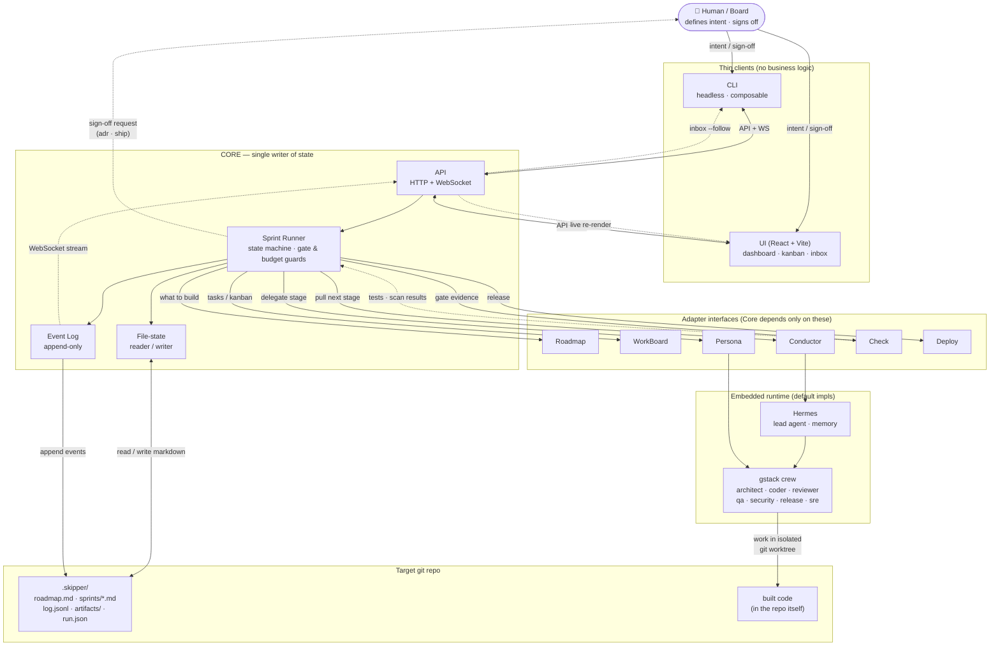

# Skipper — High-Level Architecture

Source of truth: [`spec/01-architecture.md`](../spec/01-architecture.md). This is a
visual summary of components and the one-loop data flow.

## Components & data flow

## The loop, in order

1. **Intent in** — human adds to the roadmap via CLI or UI → Core writes `roadmap.md`.
2. **Plan** — the Runner dissects intent into an ordered sprint, writes `sprints/*.md`,
   appends `sprint.created` to `log.jsonl`.
3. **Drive** — Conductor (Hermes) pulls the next stage; Core advances **only** when the
   stage's gate condition holds (passing check or recorded human sign-off).
4. **Delegate** — the lead agent hands the stage to the right Persona (crew role), which
   works in an isolated git worktree.
5. **Record** — every handoff, artifact, sign-off, and transition is appended to the
   event log. Nothing bypasses Core.
6. **Stream out** — Core pushes changes over WebSocket; the UI re-renders live and the
   CLI `inbox --follow` tails the same stream.

## Invariants the diagram encodes

- **Single writer** — only Core mutates project state; agents request changes through
  Core operations.
- **Sign-offs aren't self-issuable** — the two gates (`adr`, `ship`) require a recorded
  human approval the Runner re-reads; no agent can mint one.
- **Core ⇄ adapters only** — Core never imports a concrete tool; swapping Hermes / Jira /
  a coder is an adapter change, not a Core change.
- **State is files** — `.skipper/` (markdown + append-only JSONL) versioned in the repo;
  no database.
